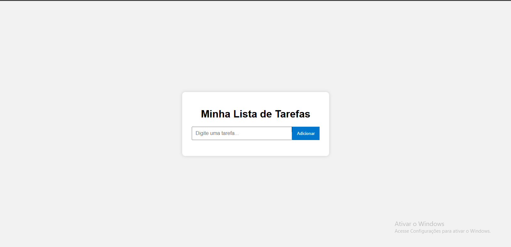

# Lista de Tarefas (To-do List)

Projeto simples feito com HTML, CSS e JavaScript puro.

## Funcionalidades

- Adicionar novas tarefas
- Marcar tarefas como concluídas
- Editar tarefas
- Remover tarefas
- Salvamento automático no navegador com localStorage

## 💻 Tecnologias usadas

- HTML5
- CSS3
- JavaScript (Vanilla)

## 📸 Preview

## Como usar

1. Clone o repositório
2. Abra o arquivo `index.html` no navegador

---
